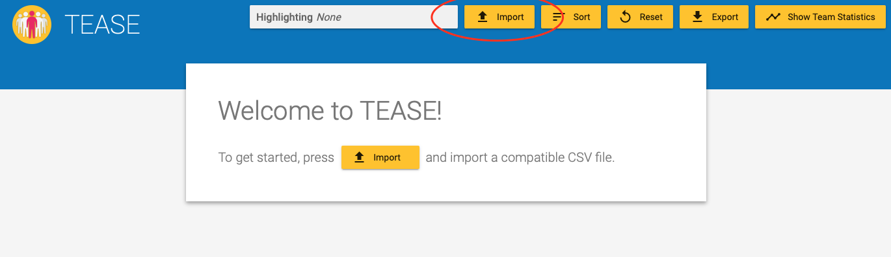
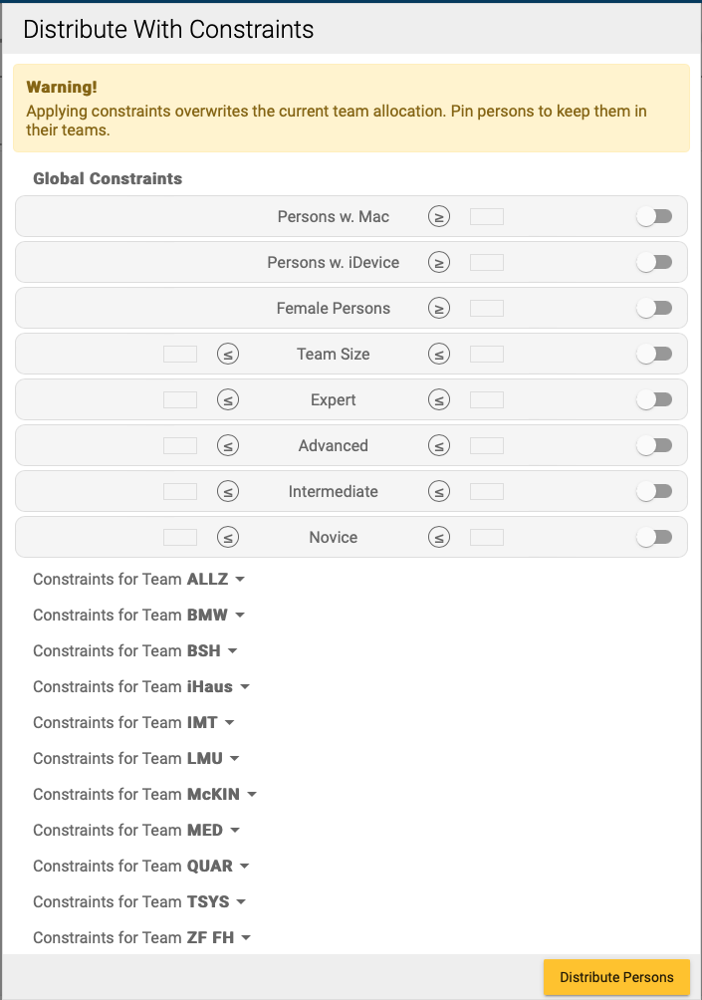

# Tease

Team allocation decision support system as used in the iPraktikum.

## Prerequisites

1. Install [Docker](https://docs.docker.com/get-docker/)
2. Either clone this repository or download one of the images found under the packages menu

## Usage - Starting TEASE

If you downloaded the repository, build the docker image (from inside the repositorie's root directory):
```
docker build -t <image-name> .
```

The container will take a little while to download the node dependencies and then compile the Angular project.

Run the docker image using:
```
docker run -ti -p 8080:80 --name tease-container <image-name>
```

After Angular is done preparing the application open [localhost:8080](https://localhost:8080) and choose to either import the example team data that is shipped with the repository or specify a different file.



In **Distribute With Constraints** you can set global and team-specific constraints (e.g. minimum or maximum number of experienced developers, female developers, developers with a mac, etc.). People can be pinned to a team and assigned manually.



The result can be exported as a CSV file, which can later be imported again to change the team allocation. Additionally team cards can be imported which generates images of the teams.

## Development server

Run `ng serve` for a dev server. Navigate to `http://localhost:4200/`. The application will automatically reload if you change any of the source files.

---

For the deprecated documentation of previous versions of this repository (including info regarding build & deployment, code structure, older known issues and miscellaneous notes) please see the README from older commits.

---

## Running unit tests

Run `ng test` to execute the unit tests via [Karma](https://karma-runner.github.io).

## Running end-to-end tests

Run `ng e2e` to execute the end-to-end tests via a platform of your choice. To use this command, you need to first add a package that implements end-to-end testing capabilities.