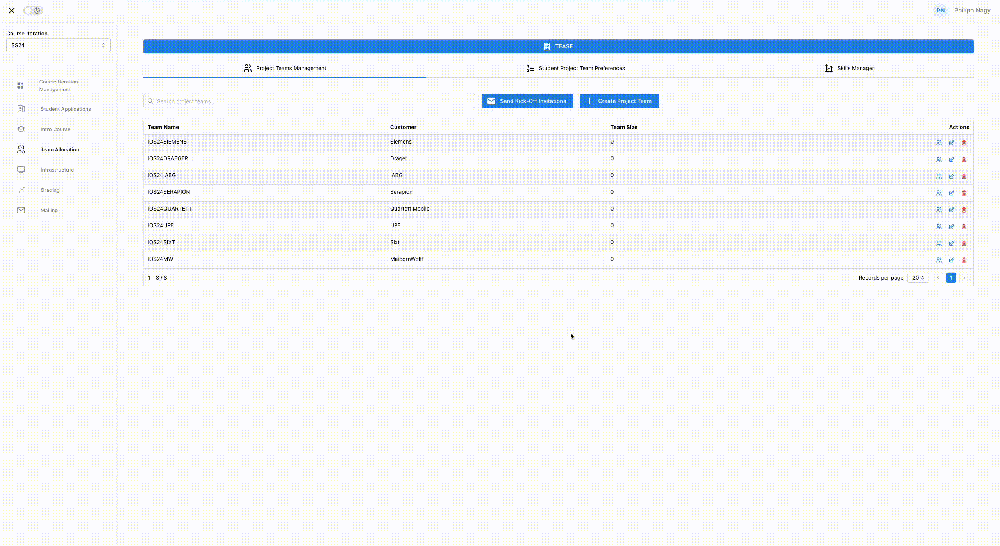
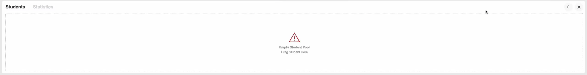
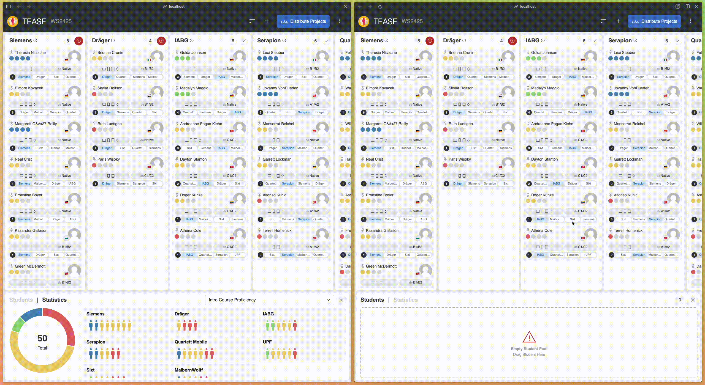
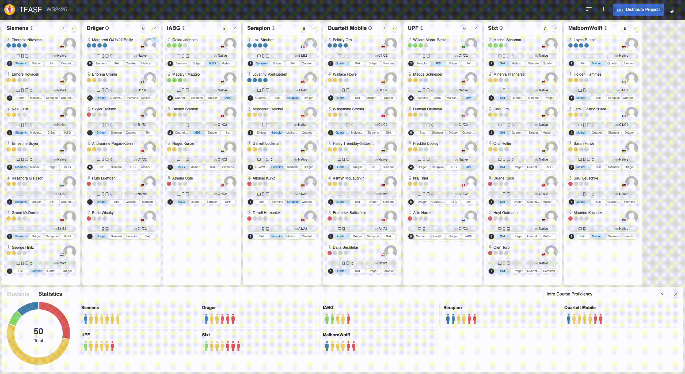

# Table of Contents

1. [Introduction](#introduction)
2. [User Guide](#user-guide)
3. [Installation](#installation)
4. [Development](#development)
5. [PROMPT Integration](#prompt-integration)
6. [Deployment](#deployment)

# Introduction

The **Team Allocator for Software Engineering courses (TEASE)** is an open source team allocation decision support system for project-based courses.
With TEASE one can [import](#import-data) student and project team data directly from [PROMPT](https://github.com/ls1intum/prompt), a support tool designed to assist program management in project-based courses, or from a [CSV](#csv-file) file.
Users can [create constraints](#constraints) based on factors such as skills, available development devices, gender, nationality, language proficiency, and team size.
The [matching algorithm](#matching-algorithm) evaluates all constraints and selects the allocation with the highest priority distribution.
[Statistics](#statistics) allow for detailed analysis and the ability to fine-tune allocations with manual adjustments.
The [live collaboration](#live-collaboration) feature enables multiple program managers to work on the same course iteration and update data in real time.
Once the allocation is complete, users can [export](#export-data) the data back to PROMPT, as a CSV file, or as images.

# User Guide

1. [Overview](#overview)
2. [Import Data](#import-data)
3. [Matching](#matching)
4. [Statistics](#statistics)
5. [Live Collaboration](#live-collaboration)
6. [Export Data](#export-data)

## Overview

To start using TEASE, import the student and project team data. After importing, users can create constraints for the matching algorithm, view statistics, and fine-tune the allocation through manual adjustments. When importing the same course iteration from PROMPT, multiple users can collaborate on it in real time. Once users finalize the allocation, they can export it back to PROMPT, as a CSV file for other project-related tasks, or as images for easy viewing.

### User Interface Layout

The main view of TEASE consists of 3 sections:

- **Navigation Bar**: The navigation bar provides access to various actions such as importing and exporting data, assigning students to project teams and creating constraints.
- **Project Team Section**: The Project Team section displays all project teams and their members. It shows the number of students in each team and whether the constraints are met.
- **The Utility Section**: The Utility Section provides access to the student pool, which contains all students not assigned to a project team. The statistics are within the same section. The entire section can be minimized when not in use.


## Import Data

TEASE offers two ways to import student and project team data:

- PROMPT
- CSV File

A sample dataset is also available for testing purposes and is displayed in the import modal for direct import.
The CSV file is also available [here](https://github.com/ls1intum/tease/blob/main/client/src/assets/persons_example.csv).

### PROMPT

To use the PROMPT import, TEASE must be deployed on PROMPT.
Log in to PROMPT as a program manager to authenticate and authorize secure access to student data.
For detailed information about the PROMPT integration, see the [PROMPT Integration](#prompt-integration) section.

To ensure that the requirements are met, open TEASE with PROMPT from the team allocation section.
Once the requirements are met, TEASE will prompt the user to import the latest data from PROMPT.
In the import modal, users can select the specific course iteration to import.



### CSV File

To use the CSV File import, the use of a specific format is required.

| firstName | lastName | email                 | gender | id  | semester | studyDegree | studyProgram        | skillLevel   | language[de] | language[en] | nationality | projectPreference[TUM] | projectPreference[LMU] | skill[ML]    | skill[iOS]   | device[IPhone] | device[Mac] | device[IPad] | device[Watch] |
| --------- | -------- | --------------------- | ------ | --- | -------- | ----------- | ------------------- | ------------ | ------------ | ------------ | ----------- | ---------------------- | ---------------------- | ------------ | ------------ | -------------- | ----------- | ------------ | ------------- |
| Alice     | Smith    | alice.smith@email.com | Female | 001 | 3        | Master      | Information Systems | Advanced     | A1/A2        | Native       | US          | 0                      | 1                      | Novice       | Advanced     | true           | false       | true         | false         |
| Bob       | Johnson  | bob.johnson@email.com | Male   | 002 | 5        | Bachelor    | Information Systems | Intermediate | Native       | B1/B2        | DE          | 0                      | 1                      | Expert       | Advanced     | true           | true        | true         | true          |
| Carol     | Lee      | carol.lee@email.com   | Male   | 003 | 7        | Bachelor    | Computer Science    | Expert       | Native       | C1/C2        | DE          | 1                      | 0                      | Intermediate | Intermediate | true           | true        | false        | false         |

```
firstName,lastName,email,gender,id,semester,studyDegree,studyProgram,skillLevel,language[de],language[en],nationality,projectPreference[TUM],projectPreference[LMU],skill[ML],skill[iOS],device[IPhone],device[Mac],device[IPad],device[Watch]
Alice,Smith,alice.smith@email.com,Female,001,3,Master,Information Systems,Advanced,A1/A2,Native,US,0,1,Novice,Advanced,true,false,true,false
Bob,Johnson,bob.johnson@email.com,Male,002,5,Bachelor,Information Systems,Intermediate,Native,B1/B2,DE,0,1,Expert,Advanced,true,true,true,true
Carol,Lee,carol.lee@email.com,Male,003,7,Bachelor,Computer Science,Expert,Native,C1/C2,DE,1,0,Intermediate,Intermediate,true,true,false,false
```

#### Mandatory Header Fields:

- firstName
- lastName
- email
- gender
- id
- semester
- studyDegree
- studyProgram
- skillLevel
- nationality
- devices
  - device[IPhone]
  - device[Mac]
  - device[IPad]
  - device[Watch]

#### Dynamic Header Fields

- language[X] (where X is the language format (ISO 639-1), currently the system requires: **de** & **en**)
- projectPreference[X] (where X is the project team name)
- skill[X] (where X is the skill name)

#### Permitted Values:

- **gender**: Female, Male, Other, Prefer not to say
- **projectPreference[x]**: 0, 1, 2, ..., n (0 is the highest priority; values must be strictly sequential from 0 to n with no duplicates)
- **skill[x]/skillLevel**: Novice, Intermediate, Advanced, Expert (where Novice < Intermediate < Advanced < Expert)
- **language[x]**: A1/A2, B1/B2, C1/C2, Native (where A1/A2 < B1/B2 < C1/C2 < Native)
- **nationality**: ISO 3166-1 alpha-2
- **device**: true, false
- **firstName/lastName/email/id/studyDegree/studyProgram**: String
- **semester**: Integer

## Matching

After importing the data, all the students can be found in the student pool, located at the bottom of the screen in the utility section.
The core functionality of TEASE is to automatically assign students to project teams using a matching algorithm.
Users can also manually drag and drop students into a project team, to fine tune the project team allocation.

It is important to create constraints for the matching algorithm to follow.
Without constraints, the algorithm will match students based solely on their highest priorities, which can lead to uneven team sizes, skill distributions or other imbalances.


### Constraints

Constraints are crucial for the matching algorithm, as they determine how well the results meet the desired outcome.
Users can create new constraints by clicking the plus button in the navigation bar.

A constraint consists of three parts: project selection, filter, and limits.

#### Project Selection

A constraint can be set for one or more project teams.
Each project team must fulfill the constraint.

#### Filter

A filter consists of a property and a value, with some filters using comparison operators for more customization.
For example, intro course proficiency can use the "at least" operator to filter for students with a minimum skill proficiency level of advanced.
This includes all students with an advanced or expert skill proficiency level.

Define filters based on the following properties:

- skill proficiencies
- language proficiencies
- intro course proficiency
- development devices
- gender
- nationality
- team size

The system dynamically filters students based on their properties.

#### Limits

Each constraint has an upper and lower limit.
These limits refer to the number of students who meet the filter criteria and are assigned to the project team.
The limits must be fulfilled for each selected project team.

#### Example Constraints

For a better understanding of the constraint creation process, this section contains some sample constraints.

##### Team Size Constraint

This example demonstrates how to create a constraint ensuring that each project team has a minimum of 4 and a maximum of 5 students.

- **Project Selection**: All project teams
- **Filter**: Team size
- **Limits**: Min: 4, Max: 5 (for each project team)

##### Gender Constraint

This example demonstrates how to create a constraint ensuring that each project team includes at least one female student.

- **Project Selection**: All project teams
- **Filter**: Gender equals female
- **Limits**: Min: 1 (for each project team)

##### Development Device Constraint

This example demonstrates how to create a constraint ensuring each project team includes at least one student with an iPhone.

- **Project Selection**: All project teams
- **Filter**: Development device equals iPhone
- **Limits**: Min: 1 (for each project team)

##### Machine Learning Constraint

This example demonstrates how to create a constraint ensuring that the TUM project team has at least 1 student with advanced skills in machine learning.

- **Project Selection**: TUM
- **Filter**: Machine Learning skill level at least advanced
- **Limits**: Min: 1 (for each project team)

### Matching Algorithm

TEASE's matching algorithm assigns students to project teams using a linear programming approach based on the defined constraints.
A linear programming problem is a mathematical optimization problem that consits of a linear objective function and linear constraints.
More information on linear programming can be found [here](https://www.geeksforgeeks.org/linear-programming/).

The algorithm ensures that each student is placed on exactly one project team while optimizing to maximize project preferences.
It generates only valid project team allocations, meaning that all constraints must be met.
In the case of conflicting constraints no solution can be found, and TEASE will display an error message.

TEASE solves the linear programming problem using the [jsLPSolver](https://www.npmjs.com/package/javascript-lp-solver) library.

### Constraint Summary

The Constraint Summary displays all existing constraints. It opens by clicking the "Distribute Projects" button in the navigation bar.

In this view, users can create new constraints using either the default constraint builder with the "Add Constraint" button or the nationality constraint builder with the "Add Nationality Constraints" button.

The overview shows each part of the constraints: the filter, the limits, and the selected projects. By clicking the three dots on the right, users can delete, edit, or deactivate a constraint, meaning it will not be used by the matching algorithm.

By pressing the "Distribute Teams" button, the matching algorithm distributes the students.


## Statistics

The Statistics section allows users to view detailed statistics about project teams and students. It uses different charts to visualize different metrics. Possible metrics to analyze include:

- Priority distribution
- Skill distributions (Intro Course Proficiency and other imported dynamic skills)
- Device distributions (iPhone, Mac, iPad, Watch)

The statistics are crucial for assessing the quality of the distribution and are helpful for analyzing and manually fine-tuning the allocation.



## Live Collaboration

The live collaboration feature updates all dynamic data in real-time between program managers.
This dynamic data includes students locked to project teams, project team allocations, and constraints.

To prevent misuse of the collaboration server, users must first log in to PROMPT.
Once logged in, authentication to the collaboration server happens automatically.
This feature is available only for data that users import from PROMPT.
Data synchronizes only between the same course iteration.
The course iteration appears in the navigation bar, with the live collaboration status next to it.



## Export Data

TEASE offers three ways to export data:

- PROMPT Integration
- CSV File
- Images

### PROMPT

Similar to the import, to use the PROMPT export, TEASE must be deployed on PROMPT.
Log in to PROMPT as a program manager to authenticate and authorize secure access to student data.
For more details on the PROMPT integration, see the [PROMPT Integration](#prompt-integration) section.

To ensure that the requirements are met, open TEASE with PROMPT from the team allocation section.
Only data that has been imported from PROMPT can be exported back to PROMPT.
A message will appear indicating that the export was successful.



### CSV File

The CSV export generates a CSV file with all student data and their corresponding project team allocations.

The file has the following format:

| Name        | Team |
| ----------- | ---- |
| Alice Smith | TUM  |
| Bob Johnson | LMU  |
| Carol Lee   | TUM  |

```
Name,Team
Alice Smith,TUM
Bob Johnson,LMU
Carol Lee,TUM
```

### Images

The image export generates a ZIP file containing a canvas of all project teams as displayed in the project team section of TEASE, along with individual images for each project team.

# Installation

To run the TEASE application, ensure Docker is installed on the system. Follow the installation instructions [here](https://docs.docker.com/engine/install/)

Once Docker is installed, follow these steps:

Navigate to the directory containing the `docker-compose.yml` file.

Run the following command in that directory to start the application:

```
docker compose up
```

Use `docker compose up --build` to build the images locally from the repository.

The application will be available at `http://localhost:80/tease`.

# Development

TEASE consists of a client and a server. The client is built with [Angular](https://angular.dev/), while the server utilizes [Spring Boot](https://spring.io/projects/spring-boot) with Java and functions as a [STOMP WebSocket Broker](https://docs.spring.io/spring-framework/reference/web/websocket/stomp.html).

## Client

In the client directory, run `npm install` to install all necessary dependencies.

To start the client, run `npm start` for a development server. After successful compilation, the client is available at `http://localhost:80/`.

The application will automatically reload if any of the source files changes.

The PROMPT API is automatically generated using `npm run openapi:generate` and is documented in [openapi_spec.yaml](https://github.com/ls1intum/tease/blob/main/client/docs/openapi_spec.yaml).
To explore the API documentation use the [Swagger Editor](https://editor.swagger.io/).
This documentation declares all data objects in TEASE.

## Server

In the server directory, run `mvn install` to install all necessary dependencies.

To start the server, run `mvn spring-boot:run`. After successful startup, the server is available at `http://localhost:8081/`.
The websocket server uses the STOMP messaging protocol to handle real-time communication and message exchange between clients and the server.

In general, there are four main STOMP paths:

- course-iteration/{id}/discovery
- course-iteration/{id}/allocations
- course-iteration/{id}/constraints
- course-iteration/{id}/locked-students

When a new client sends a message to the discovery channel, they receive all current states of the dynamic data through the other channels.
Any message sent to the allocations, constraints, or locked-students channels broadcasts to all connected clients, updating them with the latest information.

# PROMPT Integration

[PROMPT](https://github.com/ls1intum/prompt) is a support tool for managing project-oriented courses.
TEASE integrates closely with PROMPT, enabling direct import and export of student and project team data.
The file [openapi_spec.yaml](https://github.com/ls1intum/tease/blob/main/client/docs/openapi_spec.yaml) documents the API using the OpenAPI Specification.
Explore the API documentation using the [Swagger Editor](https://editor.swagger.io/).

To deploy TEASE alongside PROMPT, install both on the same machine.
Start by deploying PROMPT first.
Next, deploy TEASE into a directory named `tease`, which should be located directly below the top-level directory named `prompt`.
Find detailed installation instructions for TEASE in the [Installation](#installation) section.

# Deployment

Upon a new commit to the main branch in the TEASE repository, the system triggers an automatic build pipeline.
This pipeline builds a new Docker image for TEASE and deploys it to the virtual machine hosting PROMPT.
When the system is running, all incoming HTTP requests to the URL prompt.ase.cit.tum.de/tease are automatically routed to the newly deployed TEASE Docker image running on the virtual machine.e.
To facilitate data exchange between PROMPT and TEASE, it is necessary to log in to PROMPT as a member of the project management team.
This step allows to import student data from PROMPT into TEASE and later export the allocation back to PROMPT.


To deploy TEASE on a different server for production, first deploy PROMPT.
Next, deploy TEASE into a directory named `tease`, which should be located directly below the top-level directory named `prompt`.
Then configure the following environment variables in a `.tease-env.prod` file within the TEASE folder:

- **TEASE_IMAGE_TAG**: The Docker image tag of the TEASE image. By default, this is set to `latest`
- **SERVER_HOST**: The hostname of the server
- **KEYCLOAK_JWK_SET_URI**: The URI that provides the JSON Web Key Set (JWKs), which includes public keys used for token verification

Use the following command to deploy TEASE on the production server:

```bash
docker compose -f tease/docker-compose.prod.yml --env-file=.env.prod --env-file=tease/.tease-env.prod up --pull=always -d
```

To stop the TEASE application, use the following command:

```bash
docker compose -f tease/docker-compose.prod.yml --env-file=.env.prod -env-file=tease/tease-env.prod down --remove-orphans --rmi all
```
