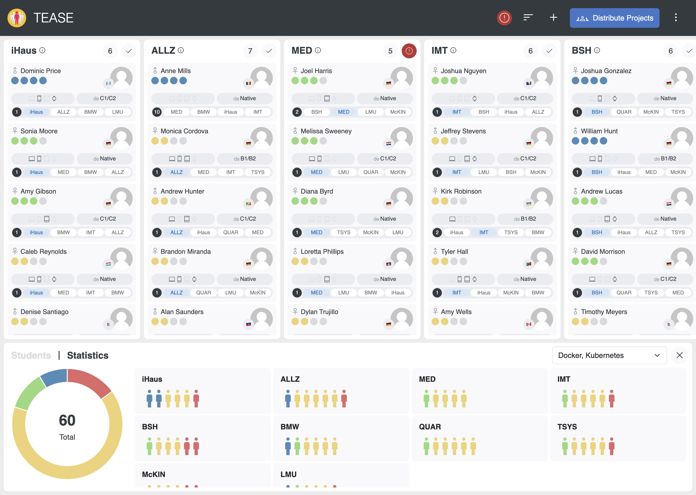
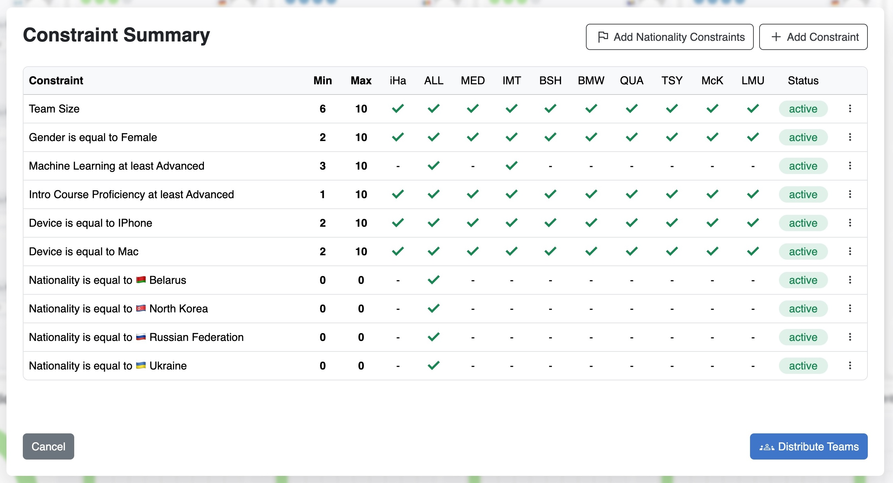
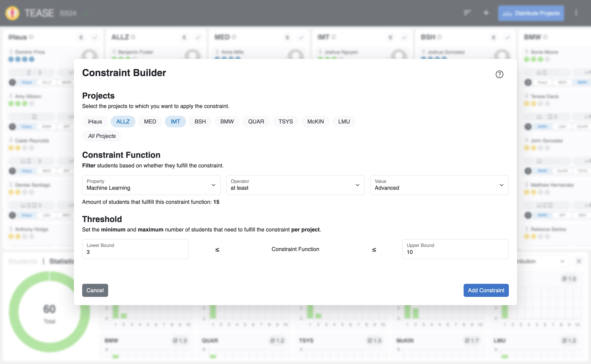
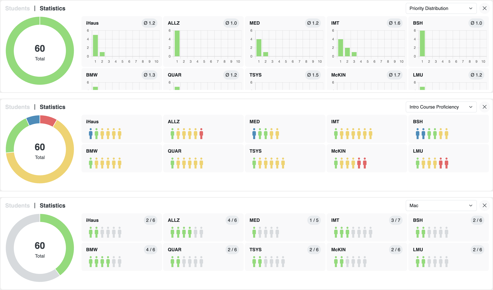

# Table of Contents

1. [Introduction](#Introduction)
2. [User Guide](#User-Guide)
  - [Overview](#Overview)
  - [Import Data](#Import-Data)
  - [Matching](#Matching)
  - [Statistics](#Statistics)
  - [Live Collaboration](#Live-Collaboration)
  - [Export Data](#Export-Data)
3. [Installation](#Installation)
4. [Development](#Development)
5. [Deployment](#Deployment)


# Introduction

The **Team Allocator for Software Engineering courses (TEASE)** is an open source team allocation decision support system for project-based courses.
With TEASE one can import student data from [Prompt](https://github.com/ls1intum/prompt) or from a CSV file.
Constraints can be created based on factors such as skills, available development devices, gender, nationality, language proficiency, and team size.
The matching algorithm evaluates all constraints and selects the solution with the highest project preferences.
Statistics allow for detailed analysis and the ability to fine-tune allocations with manual adjustments.
The live collaboration feature enables multiple program managers to work on the same course iteration and update data in real time.

# User Guide

## Overview
The main view of TEASE can be divided into 3 sections:
- **Navigation Bar**: The navigation bar provides access to various actions such as importing and exporting data, assigning students to project teams, and creating constraints.
- **Project Team Section**: The Project Team section displays all project teams and their members. It also shows the number of students in each team and whether the constraints are met.
- **The Utility Section**: The Utility section offers access to the student pool, containing all students who have not yet been assigned to a project team. The statistics can be viewed within the same section. The entire section can also be minimized when not in use.



## Import Data
TEASE offers two ways to import student and project team data:
- PROMPT Integration
- CSV File


### PROMPT Integration
To use the PROMPT integration, TEASE must be deployed on PROMPT.
For authentication and authorization, logging in to PROMPT as a program manager is mandatory for secure use of student data.

Once these requirements are met, TEASE will ask if it should import the latest data from PROMPT.

### CSV File

To use the CSV File import, the use of a specific format is required.

| firstName | lastName | email                 | gender | id  | semester | studyDegree | studyProgram        | skillLevel   | language[de] | language[en] | nationality | projectPreference[TUM] | projectPreference[LMU] | skill[ML]    | skill[iOS]   | device[IPhone] | device[Mac] | device[IPad] | device[Watch] |
| --------- | -------- | --------------------- | ------ | --- | -------- | ----------- | ------------------- | ------------ | ------------ | ------------ | ----------- | ---------------------- | ---------------------- | ------------ | ------------ | -------------- | ----------- | ------------ | ------------- |
| Alice     | Smith    | alice.smith@email.com | Female | 001 | 3        | Master      | Information Systems | Advanced     | A1/A2        | Native       | US          | 0                      | 1                      | Novice       | Advanced     | true           | false       | true         | false         |
| Bob       | Johnson  | bob.johnson@email.com | Male   | 002 | 5        | Bachelor    | Information Systems | Intermediate | Native       | B1/B2        | DE          | 0                      | 1                      | Expert       | Advanced     | true           | true        | true         | true          |
| Carol     | Lee      | carol.lee@email.com   | Male   | 003 | 7        | Bachelor    | Computer Science    | Expert       | Native       | C1/C2        | DE          | 1                      | 0                      | Intermediate | Intermediate | true           | true        | false        | false         |

```
firstName,lastName,email,gender,id,semester,studyDegree,studyProgram,skillLevel,language[de],language[en],nationality,projectPreference[TUM],projectPreference[LMU],skill[ML],skill[iOS],device[IPhone],device[Mac],device[IPad],device[Watch]
Alice,Smith,alice.smith@email.com,Female,001,3,Master,Information Systems,Advanced,A1/A2,Native,US,0,1,Novice,Advanced,true,false,true,false
Bob,Johnson,bob.johnson@email.com,Male,002,5,Bachelor,Information Systems,Intermediate,Native,B1/B2,DE,0,1,Expert,Advanced,true,true,true,true
Carol,Lee,carol.lee@email.com,Male,003,7,Bachelor,Computer Science,Expert,Native,C1/C2,DE,1,0,Intermediate,Intermediate,true,true,false,false
```

- **Gender**: Female, Male, Other, Prefer not to say
- **Project preference**: 0, 1, 2, ... (0 is the highest Priority)
- **Skill proficiency**: Novice, Intermediate, Advanced, Expert
- **Language Proficency**: A1/A2, B1/B2, C1/C2, Native
- **Nationality Format**: ISO 3166-1 alpha-2
- **Language Format**: ISO 639-1
- **Device**: true, false


## Matching
After importing the data, all students can be found in the student pool.
They can be manually dragged into the project teams or
automatically allocated using the matching algorithm.

For good results, it is important to have a set of constraints before running the matching algorithm.
All constraints can be viewed in detail in the constraint summary.


### Constraints
Constraints can be defined based on factors such as skills, development devices, gender, nationality, language proficiency, and team size.
Students are dynamically filtered according to their properties.
Each constraint has an upper and lower limit.
Constraints can be applied to all or specific project teams.



### Matching Algorithm
The matching algorithm uses a linear programming approach to match students to projects using the defined constraints.
Each student is matched to exactly one project team, with the optimization objective focused on maximizing project preferences.
The algorithm generates only valid project team allocations.


## Statistics
The Statistics section allows users to view detailed statistics about project teams and students.
The statistics use different charts to visualize different metrics.
Possible metrics to analyze are
- Project preferences
- Skill distributions
- Device distributions




## Live Collaboration
The live collaboration feature updates all dynamic data in real-time between program managers.
This dynamic data includes students locked to project teams, project team allocations, and constraints.
To utilize this feature, users must be logged in to PROMPT for authentication.
The course iteration ID from PROMPT is used to match and synchronize different sessions.


## Export Data
TEASE offers three ways to export data:
- PROMPT Integration
- CSV File
- Images

### PROMPT Integration
Similar to the import, the TEASE application must be deployed on PROMPT to use the integration.
For authentication and authorization, logging in to PROMPT as a program manager is mandatory for secure use of student data.
Only data that has been imported from PROMPT can be exported back to PROMPT.

Once these requirements are met, TEASE will display the possibility to export the data to PROMPT.

### CSV File
The CSV File export generates a file with all student data and project team allocations.

### Images
The images export generates a ZIP file with all images of the project teams.


# Installation

To start the TEASE application, follow the steps below:

Ensure that the `docker-compose.yml` file is in the directory, then run:

```
docker compose up
```

Use `docker compose up --build` to build the images locally from the repository.


# Development

TEASE consists of a client and a server. The client is built with Angular, while the server utilizes Spring Boot with Java and functions as a STOMP WebSocket Broker.

The API is automatically generated using `npm run openapi:generate` and documented with the OpenAPI Specification in [openapi_spec.yaml](../client/docs/openapi_spec.yaml)


## Client

In the client directory, run `npm install` to install all necessary dependencies.

To start the client, run `npm start` for a development server. After successful compilation, the client can be accessed at `http://localhost:80/`.

The application will automatically reload if you change any of the source files.


## Server

In the server directory, run `mvn install` to install all necessary dependencies.

To start the server, run `mvn spring-boot:run`. After successful startup, the server can be accessed at `http://localhost:8081/`.


# Deployment

Upon a new commit to the main branch in the TEASE repository, an automatic build pipeline is triggered.
This pipeline builds a new Docker image for Tease. The image is then deployed to the same virtual machine that hosts PROMPT.
Once deployed, all incoming HTTP requests to the URL prompt.ase.cit.tum.de/tease are automatically routed to and served by the newly deployed Tease Docker image running on the virtual machine.
To facilitate data exchange between PROMPT and TEASE, it is necessary to log in to PROMPT as a member of the project management team.
This step allows to import student data from PROMPT into TEASE and later export the allocation back to PROMPT.

